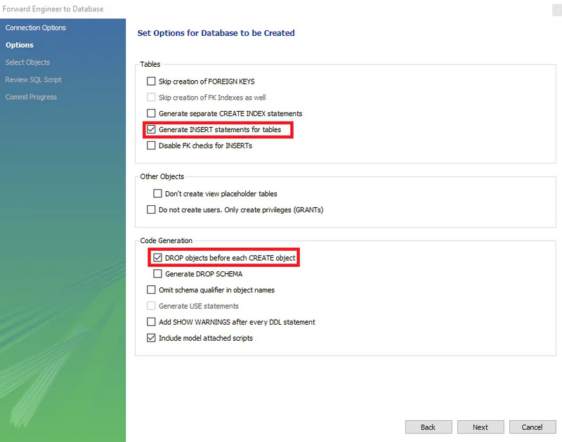
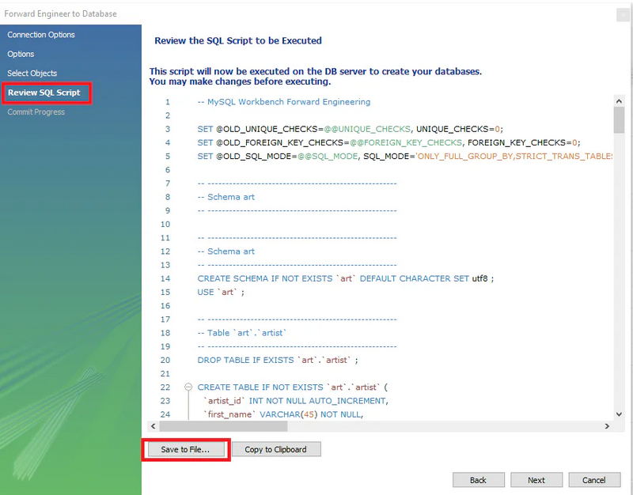

# The data modeler
## Description
In this project, you will discover how to integrate Generative AI chatbots such as ChatGPT and Gemini with [MySQL
Workbench](https://www.mysql.com/products/workbench/) for data modelling and analyses. While Generative AI provides
initial insights, MySQL Workbench serves as the
primary tool for building data models that adhere to data integrity principles. You can refine the AI-suggested model in
MySQL Workbench. Once you are satisfied with your data model, use the forward engineering functionality of MySQL
Workbench to generate the corresponding SQL code for creating the database schema for this project.

In this stage, the focus is on creating a robust data model that conforms to the principles of the Third Normal Form (
3NF) and transforming it into a functional database using MySQL Workbench. This stage lays the foundation for the
subsequent stages where we'll delve deeper into data analysis.

This first step is to supply your preferred Generative AI chatbot with the [art data](art.txt).  
Then prompt it to create a data model that conforms to the 3NF. There are at least two data models that conform to the 3NF,  
but one is much simpler to implement and understand than the other. The preferred data model must have four entities  
or tables: `artist`, `artwork`, `keyword`, `artwork_keyword`. This [video tutorial](https://www.youtube.com/watch?v=CR2ZaqkQlOE)  
is an excellent introduction to MySQL Workbench for data modelling and forward engineering.

Let's discuss the tables:
- The `artist` table contains information about the artists, while the `artwork` table stores
information about the artworks.
- An artist can have one or more artworks on the `artwork` table. Therefore, the artist table has a one-to-many relationship with the artwork table.  
- The `keyword` table is a lookup table. This means that this table will have two columns: `keyword_id` and `keyword`.  
  It stores unique keywords associated with the artworks and it is used as a reference for the other tables.
- The `artwork_keyword` table is a bridge table. This table is created when you perform a many-to-many relationship  
  between the `artwork` and `keyword` tables. Remember that a many-to-many relationship is broken down into two one-to-many relationships.  
This is exactly how `artwork_keyword` is created in MySQL Workbench.

Now let's talk about some of the data types you should look out for. The `birth_date` and `death_date` attributes are best
represented with the `DATE` data type. For the `art_year` attribute, `INT(4)` is the most appropriate because some of the
entries for this attribute are outside the allowable range for the `YEAR` data type:` '1901' `to` '2155'`.

Lastly, let's talk about the output from forward engineering that you would be submitting for this stage. The first
thing you should be aware of is that you cannot use the name of your database from MySQL Workbench here because our
system initializes a random database every time. You should not also copy any MySQL Workbench system variable including
ENGINE = InnoDB. An illustration is made with the artist table.

```markdown
-- -----------------------------------------------------
-- Table `art`.`artist`
-- -----------------------------------------------------
DROP TABLE IF EXISTS `art`.`artist` ;

CREATE TABLE IF NOT EXISTS `art`.`artist` (
  `artist_id` INT NOT NULL AUTO_INCREMENT,
  `first_name` VARCHAR(45) NOT NULL,
  `last_name` VARCHAR(45) NOT NULL,
  `birth_date` DATE NOT NULL,
  `death_date` DATE NULL,
  `nationality` VARCHAR(45) NOT NULL,
  PRIMARY KEY (`artist_id`))
ENGINE = InnoDB;
```

The database name `art` is used before the table name in the `CREATE TABLE` and `REFERENCES` statements. Remember to remove
the database name. Additionally, queries always end with `ENGINE = InnoDB`. Also, remember to remove this.  
The `artist` table becomes:

```markdown
-- -----------------------------------------------------
-- Table `artist`
-- -----------------------------------------------------
DROP TABLE IF EXISTS `artist` ;

CREATE TABLE IF NOT EXISTS `artist` (
  `artist_id` INT NOT NULL AUTO_INCREMENT,
  `first_name` VARCHAR(45) NOT NULL,
  `last_name` VARCHAR(45) NOT NULL,
  `birth_date` DATE NOT NULL,
  `death_date` DATE NULL,
  `nationality` VARCHAR(45) NOT NULL,
  PRIMARY KEY (`artist_id`));
```

Since it may take several iterations to get your final data model and schema, select _DROP objects from each CREATE
object in Code Generation_. This ensures that the old objects are dropped before the new ones are created. If you want to
use MySQL Workbench to insert your data, you should also check the `Generate INSERT statements for tables`. You will see
how to insert this way in the next stage.



Before you complete the forward engineering process, it is advisable to save the file:



## Objectives
To complete this stage:
1. Copy and paste art data into a Generative AI chatbot of your choice
2. Prompt it to generate the data model that satisfies the 3NF using information from the description
3. Carefully evaluate the AI chatbot response. Proceed to model in MySQL Workbench if you are satisfied
4. Perform forward engineering in MySQL Workbench and Save to File
5. Copy the SQL code for the four tables and paste it into the solution space
6. Remove the database name from the `CREATE TABLE` and `REFERENCES` statements
7. Paste the SQL code below at the end.

```markdown
SHOW TABLES;
SHOW COLUMNS FROM artist;
SHOW COLUMNS FROM artwork;
SHOW COLUMNS FROM keyword;
SHOW COLUMNS FROM artwork_keyword;
```
The outputs of the `SHOW TABLES` and `SHOW COLUMNS FROM artist` queries are shown in the examples below.

## Examples
### Example 1: an example of the program output
```markdown
SHOW TABLES;

Query result:
+-------------------------------+
| Tables_in_cogniterra_k0iMIXsp |
+-------------------------------+
| artist                        |
| artwork                       |
| artwork_keyword               |
| keyword                       |
+-------------------------------+
```

### Example 2: an example of the program output
```markdown
SHOW COLUMNS FROM artist;

Query result:
+-------------+-------------+------+-----+---------+----------------+
| Field       | Type        | Null | Key | Default | Extra          |
+-------------+-------------+------+-----+---------+----------------+
| artist_id   | int         | NO   | PRI | NULL    | auto_increment |
| first_name  | varchar(45) | NO   |     | NULL    |                |
| last_name   | varchar(45) | NO   |     | NULL    |                |
| birth_date  | date        | NO   |     | NULL    |                |
| death_date  | date        | YES  |     | NULL    |                |
| nationality | varchar(45) | NO   |     | NULL    |                |
+-------------+-------------+------+-----+---------+----------------+
```