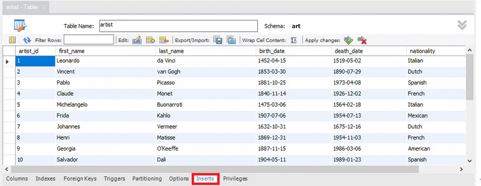

# Stage 2/5: Let Generative AI be your assistant
## Description
In stage 1, you successfully built a data model following 3NF principles and translated it into a functional  
database schema. In this stage, you will use Generative AI to assist you with creating INSERT statements for populating  
your database with the provided art data.

There are two ways you can implement INSERT leveraging Generative AI and MySQL Workbench. If you are confident  
in the INSERT statements generated by the AI chatbot, copy and paste them into the solution space below.  
This is an example of an INSERT statement generated by ChatGPT:
```markdown
-- Insert data into artist table

INSERT INTO artist (artist_id, first_name, last_name, birth_date, death_date, nationality)
VALUES 
(1, 'Leonardo', 'da Vinci', '1452-04-15', '1519-05-02', 'Italian'),
(2, 'Vincent', 'van Gogh', '1853-03-30', '1890-07-29', 'Dutch'),
(3, 'Pablo', 'Picasso', '1881-10-25', '1973-04-08', 'Spanish'),
(4, 'Claude', 'Monet', '1840-11-14', '1926-12-05', 'French'),
                       ...
(19, 'Auguste', 'Rodin', '1840-11-12', '1917-11-17', 'French'),
(20, 'Gian Lorenzo', 'Bernini', '1598-12-07', '1680-11-28', 'Italian'),
(21, 'Constantin', 'Brancusi', '1876-02-19', '1957-03-16', 'Romanian');

-- Insert data into artwork table

INSERT INTO artwork (artwork_id, art_title, art_year, art_genre, art_type, artist_id)
VALUES
(1, 'Mona Lisa', 1503, 'Renaissance', 'Painting', 1),
(2, 'The Last Supper', 1498, 'Renaissance', 'Painting', 1),
(3, 'The Starry Night', 1889, 'Post-Impressionism', 'Painting', 2),
(4, 'Sunflowers', 1888, 'Post-Impressionism', 'Painting', 2),
                       ...
(28, 'The Thinker', 1902, 'Modernism', 'Sculpture', 19),
(29, 'Apollo and Daphne', 1625, 'Baroque', 'Sculpture', 20),
(30, 'Bird in Space', 1930, 'Modernism', 'Sculpture', 21);

-- Insert data into keyword table

INSERT INTO keyword (keyword_id, keyword)
VALUES
(1, 'Portrait'),
(2, 'Smile'),
(3, 'Iconic'),
(4, 'Biblical'),
                       ...
(29, 'Rome'),
(30, 'Ancient ruins'),
(31, 'Pensive');
```

Alternatively, you can input these values into the insert section of your model in MySQL. These values would be  
included as INSERT statements in the SQL script generated by forward engineering. You will then copy and paste  
the insert statements for each table into the solution space below:



```markdown
INSERT INTO `art`.`artist` (`artist_id`, `first_name`, `last_name`, `birth_date`, `death_date`, `nationality`) VALUES (1, 'Leonardo', 'da Vinci', '1452-04-15', '1519-05-02', 'Italian');
INSERT INTO `art`.`artist` (`artist_id`, `first_name`, `last_name`, `birth_date`, `death_date`, `nationality`) VALUES (2, 'Vincent', 'van Gogh', '1853-03-30', '1890-07-29', 'Dutch');
INSERT INTO `art`.`artist` (`artist_id`, `first_name`, `last_name`, `birth_date`, `death_date`, `nationality`) VALUES (3, 'Pablo', 'Picasso', '1881-10-25', '1973-04-08', 'Spanish');
INSERT INTO `art`.`artist` (`artist_id`, `first_name`, `last_name`, `birth_date`, `death_date`, `nationality`) VALUES (4, 'Claude', 'Monet', '1840-11-14', '1926-12-05', 'French');
INSERT INTO `art`.`artist` (`artist_id`, `first_name`, `last_name`, `birth_date`, `death_date`, `nationality`) VALUES (5, 'Michelangelo', 'Buonarroti', '1475-03-06', '1564-02-18', 'Italian');
                  ...                    ...                            ...
INSERT INTO `art`.`artist` (`artist_id`, `first_name`, `last_name`, `birth_date`, `death_date`, `nationality`) VALUES (20, 'Gian Lorenzo', 'Bernini', '1598-12-07', '1680-11-28', 'Italian');
INSERT INTO `art`.`artist` (`artist_id`, `first_name`, `last_name`, `birth_date`, `death_date`, `nationality`) VALUES (21, 'Constantin', 'Brancusi', '1876-02-19', '1957-03-16', 'Romanian');
```

The database name appears in all the insert statements: ` `art`.`artist` `. Remember to change this to just the  
table name:` `artist` `. Do this for the remaining tables as well. You can join all the tables and inspect the result  
to check that it is the same as what is in the art file. Generative AI is just an assistant. It is not perfect and  
may perform well in some tasks than others. You are responsible for the final output and should ignore the chatbot  
response for tasks it cannot complete correctly.

## Objectives
To complete this stage:
1. Supply the art information and data model to a Generative AI chatbot of your choice
2. Prompt the AI chatbot to generate INSERT statements for each table
3. Carefully examine the response and modify your prompt to get better results
4. If you are confident of the response either:

   1. Copy the generated INSERT statements and paste them into the solution space OR
   2. Perform the INSERT operation using MySQL Workbench
   
      - Type the values into the columns for each table using the insert section
      - Ensure that the Generate INSERT statements for tables option is checked
      - Save the generated SQL code to file
      - Copy the INSERT statements from the saved file and paste them into the solution space
      - Complete the forward engineering process
5. Submit the INSERT statements for the four tables for evaluation

## Examples
### Example 1: an example of the program output
```markdown
-- -----------------------------------------------------
-- Data for table `artist`
-- -----------------------------------------------------

INSERT INTO `artist` (`artist_id`, `first_name`, `last_name`, `birth_date`, `death_date`, `nationality`) VALUES (1, 'Leonardo', 'da Vinci', '1452-04-15', '1519-05-02', 'Italian');
INSERT INTO `artist` (`artist_id`, `first_name`, `last_name`, `birth_date`, `death_date`, `nationality`) VALUES (2, 'Vincent', 'van Gogh', '1853-03-30', '1890-07-29', 'Dutch');
INSERT INTO `artist` (`artist_id`, `first_name`, `last_name`, `birth_date`, `death_date`, `nationality`) VALUES (3, 'Pablo', 'Picasso', '1881-10-25', '1973-04-08', 'Spanish');
 ...         ...           ...                 ...                 ...          ...
INSERT INTO `artist` (`artist_id`, `first_name`, `last_name`, `birth_date`, `death_date`, `nationality`) VALUES (19, 'Auguste', 'Rodin', '1840-11-12', '1917-11-17', 'French');
INSERT INTO `artist` (`artist_id`, `first_name`, `last_name`, `birth_date`, `death_date`, `nationality`) VALUES (20, 'Gian Lorenzo', 'Bernini', '1598-12-07', '1680-11-28', 'Italian');
INSERT INTO `artist` (`artist_id`, `first_name`, `last_name`, `birth_date`, `death_date`, `nationality`) VALUES (21, 'Constantin', 'Brancusi', '1876-02-19', '1957-03-16', 'Romanian');
```